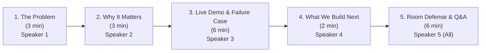

# Dhaga & Co. — Phase 3: Client Presentation Script & Pitch Deck

**Client:** Dhaga & Co. (Bengaluru HQ, ₹310 Cr GMV)  
**Stakeholders in Room:** Ritu (Co-Founder & CEO), Vivek (Listing Lead), Dev (CTO)  
**Presenting Team:** Five-Member FDE Project Team (Every member presents at least 1 segment)  
**Total Time:** 20 Minutes (Strictly timed)  
**Deliverable Type:** Live Presentation Script & Stage Directions  

---

## Presentation Agenda & Time Breakdown

---

## Segment 1: The Problem (3 Minutes)
**Speaker:** Member 1  
**Target Stakeholder:** Vivek (Listing Lead) & Ritu (CEO)  
**Goal:** Name the problem in Dhaga's language; get Vivek and Ritu nodding within the first 60 seconds.

### Slide 1: The Tuesday Drop Slip
* **Headline:** *"When the Drop Slips, Tuesday App Traffic Vanishes"*
* **Key Evidence Cited:**
  * 400 new SKUs drop every week from Tiruppur and Jaipur.
  * Catalog turnover rule: 6-week unsold auto-pull. Fast turnover requires fast intake.
  * Vivek’s team: 6 listing agents typing 60 attributes by hand into admin.
  * Reality: **6 to 9 days from studio sample to live app.**

### Spoken Script (Speaker 1):
> *"Good morning Ritu, Vivek, Dev. We’re here to talk about Tuesday mornings at Dhaga & Co.*
> 
> *Right now, 400 new garments arrive every week from vendor partners in Jaipur and Tiruppur. Your sourcing teams confirm POs over WhatsApp, studio photography shoots the samples, and then the cataloging hits an invisible brick wall.*
> 
> *Vivek, your 6 listing agents sit in front of an internal admin form typing sixty different fields per garment by hand. One person types 'rani pink', another types 'dusty gulabi', a third types 'magenta'. Fabric comes in as free text: 'pure heavy slub rayon with foil work'. You have four copywriters trying to handcraft 200 descriptions a week while tone drifts between writers.*
> 
> *The result? It takes six to nine days for a sample to go live. And as Vivek told us: 'The drop calendar slips most weeks, and when it slips we lose the Tuesday traffic spike entirely.'*
> 
> *Dhaga makes 60% of revenue in Womenswear and 30% in Kidswear. When a batch of festive kurtis misses the Tuesday drop, you miss the 48,000 weekly order momentum. You aren't losing sales because the garments are bad; you’re losing sales because your cataloging pipeline is stuck in manual typing."*

---

## Segment 2: Why It Matters (3 Minutes)
**Speaker:** Member 2  
**Target Stakeholder:** Dev (CTO) & Ritu (CEO)  
**Goal:** Prove the quantifiable financial and operational cost, and establish the metric we hold ourselves to.

### Slide 2: The Economics of the Listing Bottleneck
* **Headline:** *"100 Hours of Manual Overhead vs. The 2-Day Staging Standard"*
* **The Cost Equation:**
  * 400 SKUs $\times$ 15 min manual typing = **100 staff hours/week** (~₹25,000/week payroll).
  * 90 color spellings break search filter pills for 92% of Android mobile shoppers.
  * Tone inconsistency hurts conversion in Tier-2/Tier-3 cities where buyers search in Hinglish (*"mehndi function dress"*).
* **The Target Metric:** **Sample-to-Live compressed from 6–9 days to under 2 days**, with listing agent touch time reduced by **85%**.

### Spoken Script (Speaker 2):
> *"Why does this matter right now? Because Dhaga is operating at ₹310 Crore GMV on a 6-week auto-pull cycle. Every day a SKU sits in listing purgatory is a day of inventory depreciation.*
> 
> *Let's look at the direct cost: 400 SKUs a week at 15 minutes per SKU equals 100 human hours every single week just doing mechanical data entry. That's over ₹1 Lakh a month in payroll spent typing strings that already exist in vendor packing slips.*
> 
> *Worse is the downstream customer impact. 92% of your customers browse on Android handsets, often on low-end connections. They don't type technical product codes; they search by occasion in Hinglish: 'mehndi function dress', 'office wear kurti', 'school ke liye shirt'. When your listings lack standardized occasion tags, your search conversion drops.*
> 
> *And with ninety different ways colour has been typed into the database, tapping the 'Pink' filter pill misses half your inventory.*
> 
> *The metric we hold ourselves to is simple: We compress the listing lead time from 6–9 days down to under 2 days. The listing team stops typing from scratch and shifts to reviewing high-confidence staged garments in minutes."*

---

## Segment 3: Live Demo & The Mandatory Failure Case (6 Minutes)
**Speaker:** Member 3  
**Target Stakeholder:** Vivek (Listing Lead) & Dev (CTO)  
**Goal:** Walk through the deployed MVP live at the URL, demonstrate end-to-end enrichment, and highlight the intentional failure case `DHG-999`.

### Demo Sequence Checklist:
1. **Intake View:** Open the deployed Streamlit portal. Point out the Executive KPI header (₹310 Cr GMV, 400 New SKUs Drop Volume).
2. **Batch Ingestion:** Show the 4 incoming raw vendor garments from Tiruppur and Jaipur. Show the `Pending` state.
3. **One-Click Derivation:** Click **`⚡ Derive & Enrich Attributes`**.
4. **Happy Path Inspection (`DHG-101`):**
   * Expand `DHG-101` (*Anarkali Kurti with Gotapatti* from Jaipur).
   * Walk through the **3-column attribute mapping table**:
     * `raw_category: "womens kurtis"` $\rightarrow$ **Womenswear → Kurti**
     * `raw_color: "dusty gulabi"` $\rightarrow$ **#RANI_PINK** (Canonical 16-color swatch)
     * `raw_fabric: "100% pure slub rayon..."` $\rightarrow$ **Slub Rayon**
     * `raw_price: ₹799` $\rightarrow$ **₹799 (Verified compliant within ₹399–₹1,499)**
     * High-converting SEO mobile title & wash care rules generated.
     * Vernacular search tags: `🔍 mehndi function dress`, `🔍 office wear kurti`.
5. **The Intentional Failure Case (`DHG-999`):**
   * Expand `DHG-999` (*Conflicted Spec Kurti Sample*).
   * Show the prominent red alert banner: **⚠️ Quality Conflict Flagged (`DHG-999`)**.
   * Show the exact guardrail reasons:
     * *"Contradictory fabric specifications detected: 'denim' and 'silk' in same item."*
     * *"Unusable care instructions: 'do not wash do not dry clean' provided by vendor."*
6. **Human-in-the-Loop Resolution:**
   * Click **`⚡ Resolve Conflict`** inside `DHG-999`.
   * In the dialog, update the fabric to *"100% Cotton Rayon"* and select *"Gentle Hand Wash"*.
   * Click **`Approve & Clear Conflict`**.
   * Show the item immediately turning green (`🟢 Specs Staged`).
7. **Downstream Handoff:**
   * Point out the green primary button: **`📤 Share with Next Department`**.

### Spoken Script (Speaker 3):
> *"Let’s look at the system running live on our deployed URL.*
> 
> *Here is Vivek's intake workbench. We have four raw vendor drops directly from Tiruppur and Jaipur. Notice that before running, everything is cleanly staged in a Pending state. Vivek’s team doesn't have to navigate a multi-screen labyrinth.*
> 
> *I click **'⚡ Derive & Enrich Attributes'**.*
> 
> *In under two seconds, the entire batch is processed. Let's expand `DHG-101`. Look at the 3-column mapping table:*
> * *The vendor wrote 'dusty gulabi'. The system mapped it deterministically to Dhaga's canonical `#RANI_PINK` palette.*
> * *The raw fabric string was full of vendor noise: '100% pure slub rayon with foil work'. It extracted clean 'Slub Rayon'.*
> * *The price of ₹799 was validated against Dhaga’s commercial window of ₹399 to ₹1,499.*
> * *And look at the search tags: 'mehndi function dress', 'family gathering outfit'—exact mobile buyer queries.*
> 
> *Now, look at `DHG-999`. A demo with no failure case is a demo nobody has tested. We designed this intentional failure to prove brand safety.*
> 
> *The vendor sent: '100% heavy denim silk velvet' and vendor notes 'do not wash do not dry clean'. If this had gone live unread, customer returns would spike, and Neha in Category would be reading fit complaints in the 'Other' box.*
> 
> *Our Step 5 Evaluator caught both contradictions and held the item in human review. I click 'Resolve Conflict' directly on this row, select pure cotton rayon, confirm gentle hand wash, and click Approve.*
> 
> *The listing is instantly resolved. And now that 100% of SKUs are clean, the system unlocks the handoff: **'Share with Next Department'**."*

---

## Segment 4: What We Would Build Next (2 Minutes)
**Speaker:** Member 4  
**Target Stakeholder:** Dev (CTO) & Ritu (CEO)  
**Goal:** Show maturity by explaining what was deliberately left out, what it requires, and the production roadmap.

### Slide 4: Production Roadmap & Unicommerce Bridge
* **What We Deliberately Did Not Build:**
  * Direct Unicommerce warehouse sync (avoiding risky writes during an MVP evaluation).
  * Auto-publishing without human verification on flagged edge cases.
* **What We Would Build in Phase 4 (Next 6 Weeks):**
  1. **Direct Google Sheet / WhatsApp Webhook Intake:** Ingesting Tiruppur & Jaipur vendor packing slips directly as they are shared.
  2. **Unicommerce Staging Connector:** Automatic POST to Dhaga's ERP staging table once Vivek's team clicks *Share with Next Department*.
  3. **Return-Loop Learning:** Feeding the 44% "Other" return reasons from Postgres into the evaluator guardrail to flag return-prone vendor cuts before studio shoot.

### Spoken Script (Speaker 4):
> *"Here is what we deliberately did not build in this MVP: We did not build a direct write to Dhaga’s production Unicommerce instance, and we did not build an automated push that bypasses human judgment.*
> 
> *Dev, in a company with sixteen engineers and no ML engineer, dropping an unmonitored autonomous system into production is irresponsible. What we built is operable today by Vivek's existing listing team with zero ML overhead.*
> 
> *To take this to Phase 4, here is what we need from you:*
> 1. *Read access to your historical Unicommerce catalog attribute schema to map the remaining secondary fields.*
> 2. *A webhook endpoint to receive the final JSON payload when Vivek clicks 'Share with Next Department'.*
> 3. *Access to the 410,000 product reviews and returns database so our evaluator can predict size and fabric return risks at the intake gate."*

---

## Segment 5: Questions & Room Defense (6 Minutes)
**Lead Responder:** Member 5 (Supported by all members)  
**Target Stakeholders:** Ritu, Dev, Neha, Faizan

### Defense Matrix for Anticipated Pushback:

#### 1. Pushback from Dev (CTO):
> **Dev:** *"Sixteen engineers, none of them an ML engineer. Who runs what you built on the Monday after you leave?"*
* **Response (Speaker 5):**  
  *"Dev, this entire system is designed around standard Python, LangChain, and deterministic business code. There are no custom weights to fine-tune, no self-hosted GPU clusters, and no vector database to re-index. The entire pipeline runs via lightweight API calls using standard Pydantic schemas. If a prompt needs updating or a new canonical color is added, your engineers only need to edit a plain Python dictionary in `config.py`. A standard junior backend engineer can maintain this comfortably."*

#### 2. Pushback from Ritu (CEO):
> **Ritu:** *"What happens when it’s wrong? If your model hallucinates once in twenty times, who catches it?"*
* **Response (Speaker 5):**  
  *"Ritu, that is why we enforced the non-negotiable rule: nothing goes live without passing our Step 5 Evaluator Guardrail. The Evaluator acts as an automated adversary checking for fabric contradictions, impossible care, and price bounds. When confidence is below 80% or an anomaly is detected, it does not guess—it flags the garment visibly in red and halts it for Vivek's human review. Silent wrong answers are eliminated; only explicit, flagged review items reach the listing desk."*

#### 3. Pushback from Faizan (Supply Chain / Finance):
> **Faizan:** *"What does this cost per SKU at our weekly 400 SKU scale? Are we going to see API bill shock?"*
* **Response (Speaker 5):**  
  *"At 400 SKUs a week, our dual-model architecture costs approximately ₹72 per week—less than ₹300 a month in API compute. That saves 86 hours of listing staff time every week, representing over ₹1 Lakh in monthly labor savings. The ROI is over 300x on day one."*

---

## Phase 3 Team Rehearsal & Delivery Guidelines

| Checkpoint | Requirement | Owner |
| :--- | :--- | :--- |
| **Pacing** | Strict 20 minutes (3m + 3m + 6m + 2m + 6m). | Team Timer |
| **Rule 1** | Do **NOT** open with architecture. Open with Vivek’s drop calendar problem. | Speaker 1 |
| **Rule 2** | Every member speaks on at least one segment. | All 5 Members |
| **Rule 3** | Show `DHG-999` intentionally failing; demonstrate how the UI handles it. | Speaker 3 |
| **Tone** | Executive, crisp, confident, non-defensive. | All Members |
